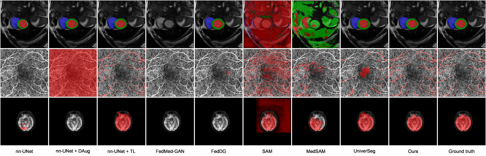

## RobustMedSeg &mdash; Official PyTorch Implementation

**Picture:** 
*Comparative analysis of the segmentation results: heart segmentation w/ scanner Siemens (top), vessel segmentation w/ OCTA imagery (center), and brain segmentation w/ PET scans (bottom) using different methods.*

This repository allows users to produce accurate segmentation with minimal training and annotation efforts. It contains the official PyTorch implementation of the following paper:

> **Federated Multi-Centric Image Segmentation with Uneven Label Distribution** 
> Francesco Galati, Rosa Cortese, Ferran Prados, Marco Lorenzi, Maria A. Zuluaga 
> In: Medical Image Computing and Computer Assisted Intervention – MICCAI (2024)
>
> **Abstract:** 
*While federated learning is the state-of-the-art methodology for collaborative learning, its adoption for training segmentation models often relies on the assumption of uniform label distributions across participants, and is generally sensitive to the large variability of multi-centric imaging data. To overcome these issues, we propose a novel federated image segmentation approach adapted to complex non-iid setting typical of real-life conditions. We assume that labeled dataset is not available to all clients, and that clients data exhibit differences in distribution due to three factors: different scanners, imaging modalities and imaged organs. Our proposed framework collaboratively builds a multimodal data factory that embeds a shared, disentangled latent representation across participants. In a second asynchronous stage, this setup enables local domain adaptation without exchanging raw data or annotations, facilitating target segmentation. We evaluate our method across three distinct scenarios, including multi-scanner cardiac magnetic resonance segmentation, multi-modality skull stripping, and multi-organ vascular segmentation. The results obtained demonstrate the quality and robustness of our approach as compared to the state-of-the-art methods.*

## System requirements
- batchgenerators==0.25
- evalutils==0.4.2
- matplotlib==3.8.2
- MedPy==0.4.0
- nibabel==5.2.0
- nilearn==0.10.3
- opencv-python==4.6.0.66
- open-clip-torch==2.24.0
- pytorch-msssim==1.0.0
- scikit-image==0.22.0
- SimpleITK==2.3.1
- tensorboard==2.15.1
- torch==1.13.1+cu116

## Preparing datasets for training

Please refer to the homonymous section in `MultiMedSeg/README.md`.

## Training networks

### Phase 1

### Phase 2
